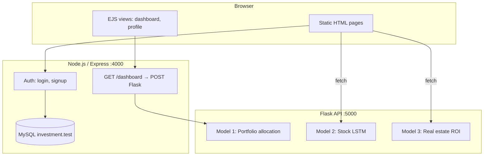
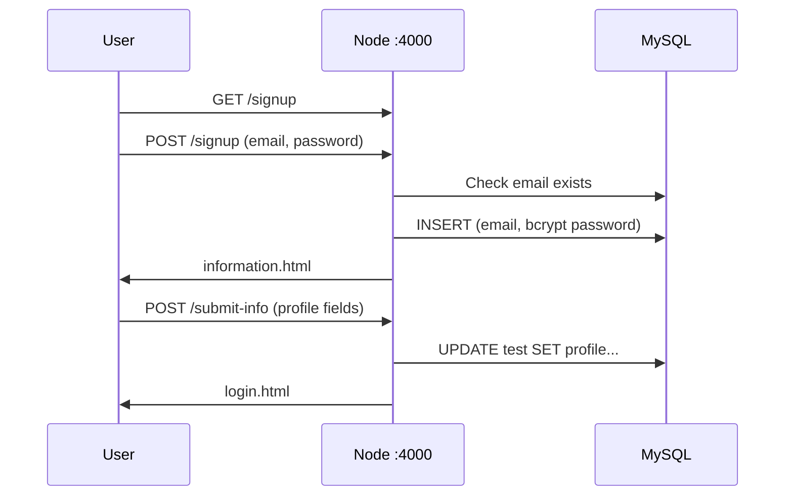

# SmartInvest — Product Documentation

**AI-Powered Investment Advisory System** (Patent Published)

This document describes the full product: architecture, user flows, ML models, APIs, database, and local setup. The application lives under:

`smart_invest/SmartInvest-AI-Powered-Investment-Advisory-System/`

---

## Table of contents

1. [Product overview](#1-product-overview)
2. [Architecture](#2-architecture)
3. [Repository layout](#3-repository-layout)
4. [User journeys](#4-user-journeys)
5. [Node.js backend](#5-nodejs-backend)
6. [Flask ML service](#6-flask-ml-service)
7. [Machine learning models](#7-machine-learning-models)
8. [Frontend pages](#8-frontend-pages)
9. [Dependencies](#9-dependencies)
10. [Local setup](#10-local-setup)
11. [Data assets](#11-data-assets)
12. [Known limitations](#12-known-limitations)

---

## 1. Product overview

**SmartInvest** (branded **InvestAI** on the landing page) is a web application that:

1. Registers users and collects a **financial profile** (age, income, risk tolerance, horizon, etc.).
2. Uses **machine learning** to suggest a **portfolio split** across four assets: stocks, bonds, gold, and real estate.
3. Provides specialized tools for:
   - **Stock price forecasting** (deep learning)
   - **Real estate ROI** and property recommendations (ML + business rules)
   - **Gold trends** (UI demo only — static charts, not a trained model)

### Tech stack

| Layer | Technology | Default port |
|--------|------------|--------------|
| Frontend | HTML, Tailwind CDN, Chart.js, EJS | Served by Express |
| App server | Node.js, Express 5 (ES modules) | **4000** |
| ML API | Python Flask + CORS | **5000** |
| Database | MySQL (`investment` database) | **3306** |

**Both Node and Flask must run** for the full experience. Stock and real-estate pages call Flask from the browser; the AI portfolio dashboard goes **Node → Flask**.

---

## 2. Architecture



### Request flow summary

```
User Browser
    │
    ├─► :4000 Express ──► MySQL (users, profiles)
    │         │
    │         └─► :5000 /predict (portfolio only)
    │
    ├─► :5000 /predict_stocks      (stocks.html)
    └─► :5000 /predict_properties  (Realestate.html)
```

### “Three models” vs “four asset classes”

The repo ships **three trained ML artifacts**:

| # | Model | Purpose |
|---|--------|---------|
| 1 | `model1_allocation.pkl` | Multi-output allocation for **stocks, bonds, gold, real estate** (one model, four outputs) |
| 2 | `model2_stock_predictor.h5` | Stock price features (LSTM) |
| 3 | `model3_property_predictor.pkl` | Real estate ROI ranking |

The **gold page** does not use ML — it displays hardcoded chart data in JavaScript.

---

## 3. Repository layout

```
Smart-Investment-Project/
├── README.md
├── LICENSE
├── docs/
│   └── PRODUCT.md          ← this file
└── smart_invest/
    └── SmartInvest-AI-Powered-Investment-Advisory-System/
        ├── index.js                 # Express server
        ├── package.json
        ├── public/                  # Static frontend
        │   ├── index.html           # Landing (InvestAI)
        │   ├── login.html, signup.html
        │   ├── information.html     # Profile questionnaire
        │   ├── dashboard.html       # Hub after login
        │   ├── stocks.html, Realestate.html, gold.html
        │   └── images/
        ├── views/
        │   ├── dashboard.ejs        # AI portfolio allocation UI
        │   └── profile.ejs
        └── flask app/
            ├── app.py               # ML API
            ├── train_model.py         # Model 1 training (Colab export)
            ├── model1_allocation.pkl
            ├── model2_stock_predictor.h5
            ├── model3_property_predictor.pkl
            ├── scaler_stock_predictor.pkl
            ├── X_columns_property.pkl
            ├── df_scaled.csv
            ├── synthetic_investment_dataset_30k.csv
            └── testing.csv
```

---

## 4. User journeys

### 4.1 New user registration



**Profile fields** (`information.html` → `POST /submit-info`):

| Field | Type / values |
|--------|----------------|
| fullname | text |
| age | 18–100 |
| gender | Male, Female |
| education_level | High School, Graduate, Post-Graduate, Doctorate |
| annual_income | ₹ (number) |
| investment_amount | ₹ (number) |
| financial_knowledge | 0–10 |
| risk_tolerance | 0–10 |
| investment_horizon | Short, Medium, Long |

### 4.2 Login

- `POST /login` with email and password.
- Password verified with **bcrypt** against MySQL.
- On success: static **`dashboard.html`** (navigation hub).
- On failure: redirected to signup (401).

> **Note:** After login you land on the hub. Open **`/dashboard`** for the AI portfolio allocation view.

### 4.3 AI portfolio dashboard

1. User visits **`GET /dashboard`**.
2. Node loads profile for the logged-in email.
3. Node `POST`s profile JSON to Flask `http://127.0.0.1:5000/predict`.
4. Flask returns allocation percentages and a base64 pie chart.
5. Node renders **`views/dashboard.ejs`**.

### 4.4 Stock predictions

- Open `stocks.html`, select future date and ticker.
- Browser `POST`s to `http://localhost:5000/predict_stocks`.
- Supported tickers: AAPL, MSFT, TSLA, GOOGL, AMZN, NFLX, DPZ.

### 4.5 Real estate ROI

- Open `Realestate.html`, enter investment amount (₹).
- Browser `POST`s to `http://localhost:5000/predict_properties`.
- Returns top **5 properties** with ROI, rental income, and charts.

### 4.6 Gold page

- `gold.html` only — **no backend**.
- Chart data is hardcoded in JavaScript.

### 4.7 Profile

- `GET /profile` → `profile.ejs` with stored fields.
- `GET /update-info` → redirects toward the information form.

---

## 5. Node.js backend

**File:** `smart_invest/SmartInvest-AI-Powered-Investment-Advisory-System/index.js`

### Responsibilities

- Serve static files from `public/`.
- User authentication (signup/login) with **bcrypt** (cost factor 10).
- Read/write MySQL table `test`.
- Orchestrate portfolio prediction via Flask for `/dashboard`.

### Routes

| Method | Path | Behavior |
|--------|------|----------|
| GET | `/` | Landing (`index.html`) |
| GET | `/login`, `/signup` | Auth pages |
| POST | `/login` | Verify user → `dashboard.html` |
| POST | `/signup` | Create user → `information.html` |
| POST | `/submit-info` | Update profile → `login.html` |
| GET | `/profile` | Render `profile.ejs` |
| GET | `/update-info` | Redirect to information form |
| GET | `/dashboard` | User profile → Flask `/predict` → `dashboard.ejs` |

### Database configuration

Connection settings are in `index.js` (host, user, password, database `investment`). **Change these before deploying** — do not commit production credentials.

### Inferred MySQL schema

No `.sql` file ships with the repo. Create manually:

```sql
CREATE DATABASE IF NOT EXISTS investment;

CREATE TABLE test (
  email VARCHAR(255) PRIMARY KEY,
  password VARCHAR(255) NOT NULL,
  fullname VARCHAR(255),
  age INT,
  gender VARCHAR(50),
  education_level VARCHAR(100),
  annual_income DECIMAL(15, 2),
  investment_amount DECIMAL(15, 2),
  financial_knowledge INT,
  risk_tolerance INT,
  investment_horizon VARCHAR(50)
);
```

### Auth implementation note

Logged-in email is stored in a module-level variable (`h`) set on login/signup. This is **not** production-grade session management: it does not survive server restarts reliably and is not safe for multiple concurrent users. See [Known limitations](#12-known-limitations).

---

## 6. Flask ML service

**File:** `smart_invest/SmartInvest-AI-Powered-Investment-Advisory-System/flask app/app.py`

Runs on **port 5000** with **CORS** enabled. Models load at startup.

### API reference

| Endpoint | Method | Request body | Response |
|----------|--------|--------------|----------|
| `/predict` | POST | Profile JSON (see below) | `stocks`, `bonds`, `gold`, `real_estate`, `chart` |
| `/predict_stocks` | POST | `{ "future_date": "YYYY-MM-DD" }` | `date`, `predictions` |
| `/predict_properties` | POST | `{ "investment_amount": number }` | JSON array (top 5 properties) |

### `/predict` request body (from Node)

```json
{
  "age": 30,
  "gender": "Male",
  "education_level": "Graduate",
  "annual_income": 800000,
  "investment_amount": 500000,
  "financial_knowledge": 7,
  "risk_tolerance": 6,
  "investment_horizon": "Long"
}
```

### `/predict` response example

```json
{
  "stocks": 35.5,
  "bonds": 25.0,
  "gold": 15.0,
  "real_estate": 24.5,
  "chart": "data:image/png;base64,..."
}
```

Run Flask from the **SmartInvest project root** (parent of `flask app/`) so relative paths like `flask app/model1_allocation.pkl` resolve correctly.

---

## 7. Machine learning models

### Model 1 — Portfolio allocation

| Aspect | Detail |
|--------|--------|
| **File** | `model1_allocation.pkl` |
| **Algorithm** | `MultiOutputClassifier` + **XGBoost** (4 classes per output) |
| **Training** | `train_model.py` (from Colab notebook) |
| **Training data** | `synthetic_investment_dataset_30k.csv` (~30k rows) |
| **User inputs (8)** | Age, Gender, Education Level, Income, Investment Amount, Financial Knowledge, Risk Tolerance, Investment Horizon |
| **Engineered (5)** | Debt-to-Income Ratio, Net Worth, Occupation, Savings_Rate, Risk_Adjusted_Net_Worth |
| **Outputs (4)** | Stocks %, Bonds %, Gold %, Real Estate % |

**Pipeline:** Targets are binned (Low / Medium / High / Very High), predicted as classes, mapped to bin centers (12.5, 37.5, 62.5, 87.5), then **normalized to sum to 100%**. A matplotlib **pie chart** is returned as base64 PNG.

**Feature engineering** (at inference, in `enrich_user_input`):

- Debt-to-Income = investment / income  
- Net Worth = income × 4.5 + investment  
- Occupation derived from education + income thresholds  
- Savings_Rate = Net Worth / income  
- Risk_Adjusted_Net_Worth = Net Worth × (1 − risk_tolerance / 10)

---

### Model 2 — Stock price predictor

| Aspect | Detail |
|--------|--------|
| **Files** | `model2_stock_predictor.h5`, `scaler_stock_predictor.pkl`, `df_scaled.csv` |
| **Algorithm** | **Keras** sequence model (LSTM-style; 60-day window) |
| **Tickers** | AAPL, MSFT, TSLA, GOOGL, AMZN, NFLX, DPZ |
| **Features per ticker** | Open, High, Low, Close, Volume, MA_50, MA_200, Daily_Return, Volatility |

**Inference:** Last 60 rows of scaled data → predict → inverse transform → keys like `AAPL_Open`, `AAPL_Close`, etc.

The UI accepts a “future date”; the model always uses the **last 60 days** in `df_scaled.csv` — the date does not change the input sequence.

---

### Model 3 — Real estate recommender

| Aspect | Detail |
|--------|--------|
| **Files** | `model3_property_predictor.pkl`, `X_columns_property.pkl`, `testing.csv` |
| **Catalog** | ~3,000 properties (Indian cities) |
| **Model features** | city, property_type, bhk, size_sqft, total_price, pooled_amount (+ one-hot) |
| **Predicts** | 10-year ROI rate |

**Post-processing:** Ownership %, rental income (3% base rent, compounded), 10-year returns, filter valid ownership, sort by `total_roi`, return **top 5**. Monetary fields returned in **lakhs** (÷ 10⁵).

---

### Gold and bonds (clarification)

| Asset | Implementation |
|--------|----------------|
| Bonds / gold **allocation %** | Outputs of **Model 1** |
| Gold **price page** | Static JavaScript in `gold.html` — **not ML** |

---

## 8. Frontend pages

| Page | Purpose | Backend |
|------|---------|---------|
| `index.html` | Marketing landing (InvestAI) | — |
| `login.html`, `signup.html` | Authentication | Node |
| `information.html` | Onboarding questionnaire | Node |
| `dashboard.html` | Post-login navigation hub | — |
| `dashboard.ejs` | AI allocation dashboard | Node + Flask |
| `profile.ejs` | View profile | Node + MySQL |
| `stocks.html` | Stock charts | Flask |
| `Realestate.html` | Property ROI | Flask |
| `gold.html` | Gold forecasts (demo) | — |

Branding: **InvestAI** (landing) vs **SmartInvest** (logged-in UI).

---

## 9. Dependencies

### Node (`package.json`)

- express, mysql2, bcrypt, cookie-parser, ejs, axios  
- `npm start` runs `nodemon index.js` — install nodemon globally or add it as a dev dependency.

### Python (from `app.py` imports)

```
flask
flask-cors
pandas
numpy
joblib
scikit-learn
xgboost
tensorflow
matplotlib
```

---

## 10. Local setup

### Prerequisites

- Node.js 18+ (ES modules)
- Python 3.9+ with pip
- MySQL Server

### Step 1 — Database

```sql
CREATE DATABASE investment;
-- Create table `test` using schema in section 5
```

Update MySQL credentials in `index.js`.

### Step 2 — Python ML API

```bash
cd smart_invest/SmartInvest-AI-Powered-Investment-Advisory-System

pip install flask flask-cors pandas numpy joblib scikit-learn xgboost tensorflow matplotlib

python "flask app/app.py"
```

Flask should listen on **http://127.0.0.1:5000**.

### Step 3 — Node app

```bash
cd smart_invest/SmartInvest-AI-Powered-Investment-Advisory-System

npm install
node index.js
# or: npm start  (requires nodemon)
```

Open **http://localhost:4000**.

### Step 4 — Verify

1. Sign up → complete profile → log in  
2. Visit **http://localhost:4000/dashboard** (Flask must be running)  
3. Test **Stocks** and **Real Estate** pages with Flask on port 5000  

### Retrain Model 1 (optional)

```bash
cd smart_invest/SmartInvest-AI-Powered-Investment-Advisory-System/flask\ app
python train_model.py
```

Update paths in `train_model.py` if your dataset location differs.

---

## 11. Data assets

| File | Role |
|------|------|
| `synthetic_investment_dataset_30k.csv` | Training data for Model 1 |
| `df_scaled.csv` | Scaled stock time series for Model 2 |
| `testing.csv` | Property inventory for Model 3 (~3k rows) |
| `model.pkl` | Duplicate of `model1_allocation.pkl` |

Training scripts for Models 2 and 3 are not included in the repository.

---

## 12. Known limitations

1. **Session handling** — Email stored in a global variable; not suitable for production or multi-user servers.  
2. **Credentials in source** — MySQL password hardcoded in `index.js`; use environment variables for deployment.  
2. **Login vs AI dashboard** — Login opens the static hub; users must navigate to `/dashboard` for ML allocation.  
3. **Gold page** — Demo UI only; not connected to a model.  
4. **Stock date picker** — Does not alter the LSTM input sequence.  
5. **CORS** — Frontend calls `localhost:5000` directly.  
6. **Signup** — Confirm password field is not validated server-side.  
7. **Disclaimer** — Outputs are based on synthetic/historical data and models; not financial advice.

---

## License

MIT License — see [LICENSE](../LICENSE) in the repository root.
